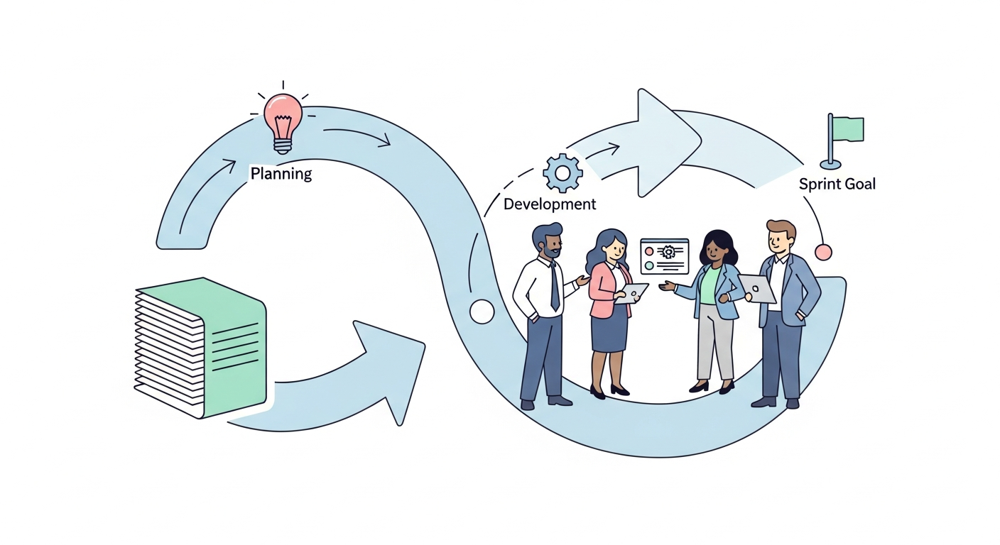
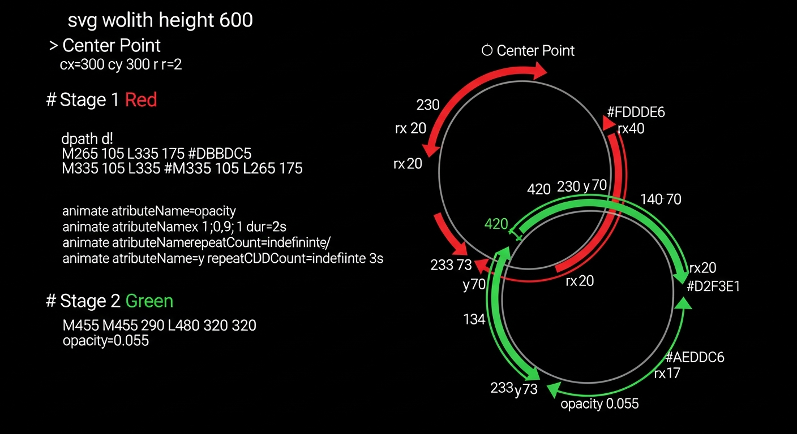

# アジャイル開発の実践

チームで成果を出すための方法論

---

## スクラムフレームワーク



イテレーティブな開発プロセス

- **スプリント**: 2-4週間の開発サイクル
- **デイリースタンドアップ**: 毎日の進捗共有
- **スプリントレビュー**: 成果物のデモ
- **レトロスペクティブ**: 振り返りと改善

<!-- note: スクラムは最も広く採用されているアジャイルフレームワークです -->

---

## カンバン方式


ワークフローの可視化と最適化

- WIP制限
- リードタイム測定
- ボトルネックの特定
- 継続的な改善

<!-- note: カンバンはトヨタ生産方式から派生した手法です -->

---

## ユーザーストーリー

要件を顧客視点で表現する手法

```
As a [ユーザータイプ]
I want [機能・行動]
So that [得られる価値]
```

- INVEST原則
- ストーリーポイント
- アクセプタンスクライテリア

<!-- note: 良いユーザーストーリーは開発チームと顧客の共通言語となります -->

---

## テスト駆動開発 (TDD)



テストを先に書く開発手法

1. Red: 失敗するテストを書く
2. Green: テストを通すコードを書く
3. Refactor: コードを改善する

<!-- note: TDDは品質の高いコードを書くための強力なプラクティスです -->

---

## 継続的インテグレーション/デリバリー

自動化されたビルドとデプロイ

- 自動テスト
- コードレビュー
- ステージング環境
- プロダクションデプロイ

<!-- note: CI/CDパイプラインは品質と速度を両立させます -->
