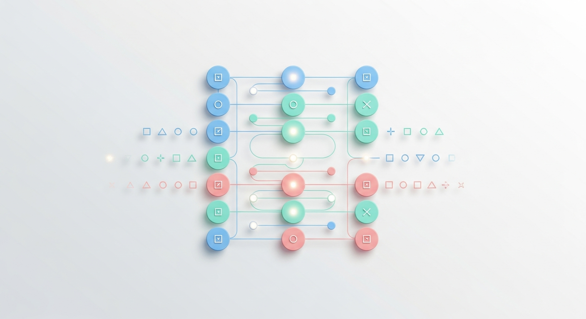
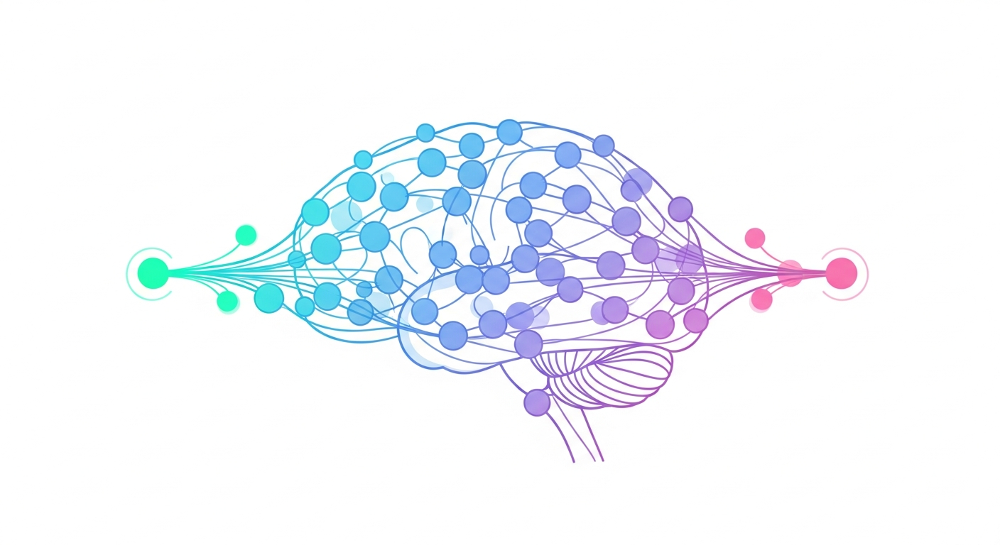

# AIの基礎と応用

人工知能の歴史から最新技術まで

<!-- note: このプレゼンテーションでは、AIの基本概念から実践的な応用まで幅広く解説します -->

---

## 機械学習とは

機械学習は、データからパターンを学習し、予測や判断を行う技術です。

- **教師あり学習**: ラベル付きデータから学習
- **教師なし学習**: データの構造を自動発見
- **強化学習**: 報酬を最大化する行動を学習

<!-- note: 機械学習の3つの主要なパラダイムについて説明しています -->

---

## ディープラーニング

ニューラルネットワークを多層に重ねた学習手法

- 画像認識
- 自然言語処理
- 音声認識
- 生成AI

<!-- note: ディープラーニングは現代のAI革命の中心技術です -->

---

## 大規模言語モデル (LLM)

GPT、Claude、Geminiなどの大規模言語モデルの特徴

- テキスト生成
- 質問応答
- コード生成
- 翻訳

<!-- note: LLMは自然言語処理の分野で革命的な進歩をもたらしました -->

---

## AIの倫理的課題

- プライバシーとデータ保護
- バイアスと公平性
- 透明性と説明可能性
- 雇用への影響

<!-- note: AI技術の発展に伴い、倫理的な配慮がますます重要になっています -->
