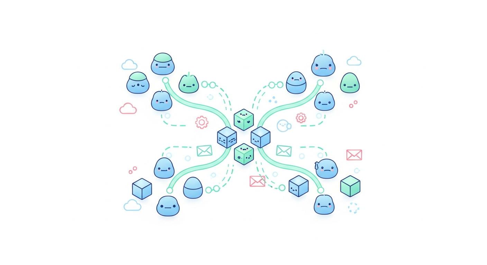
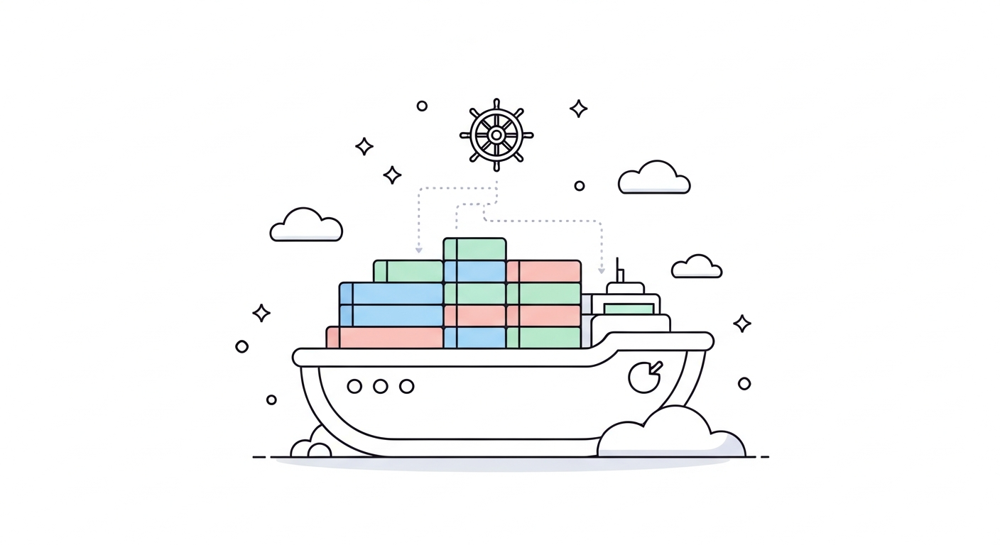

# モダンソフトウェアアーキテクチャ

スケーラブルなシステム設計のベストプラクティス

---

## マイクロサービスアーキテクチャ

小さな独立したサービスの集合体としてアプリケーションを構築

- 独立したデプロイ
- 技術スタックの自由度
- スケーラビリティ
- 障害分離

<!-- note: マイクロサービスは大規模システムでのアジリティを高めます -->

---

## APIファースト設計

APIを中心とした開発アプローチ

- RESTful API
- GraphQL
- gRPC
- OpenAPI/Swagger

<!-- note: APIファースト設計により、フロントエンドとバックエンドの分離が容易になります -->

---

## コンテナとオーケストレーション

Docker と Kubernetes によるアプリケーション管理

- コンテナ化のメリット
- Kubernetesの基本概念
- サービスメッシュ
- CI/CDパイプライン

<!-- note: コンテナ技術は現代のDevOpsの基盤となっています -->

---

## イベント駆動アーキテクチャ

非同期メッセージングによるシステム連携

- Apache Kafka
- RabbitMQ
- イベントソーシング
- CQRS パターン

<!-- note: イベント駆動アーキテクチャは疎結合なシステムを実現します -->

---

## データベース設計

用途に応じたデータベースの選択

- RDBMS (PostgreSQL, MySQL)
- NoSQL (MongoDB, DynamoDB)
- 時系列DB (InfluxDB, TimescaleDB)
- グラフDB (Neo4j)

<!-- note: ポリグロットパーシステンスにより、各ユースケースに最適なDBを選択できます -->
